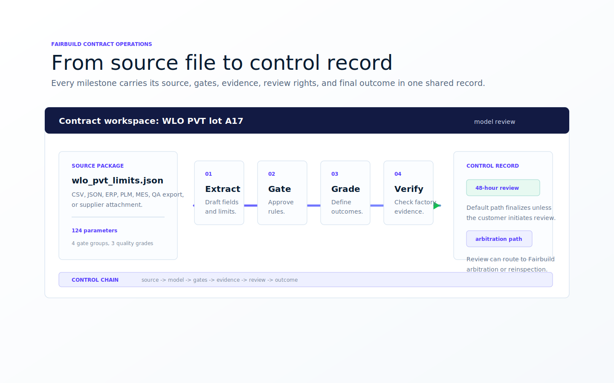

# Fairfoundry - verifiable manufacturing control layer (Soroban)

> License: CC BY-NC 4.0 | Target chain: Stellar Soroban | Language: Rust (`soroban_sdk`)

## What this repo contains

Fairfoundry is a Soroban contract workspace for turning OEM/factory manufacturing work into a shared, tamper-evident control record. It tracks production lots, evidence packages, quality gates, review windows, reinspection paths, governance updates, and non-transferable quality credentials.

Two contracts are included:

- **Fairfoundry control contract** - roles, lot lifecycle, QA evidence, review protocol, governance, and event emission
- **SVT credential contract** - non-transferable quality credentials issued after validated completion



## Why Fairbuild

Fairbuild helps OEMs and manufacturers of precision, high-volume products make production agreements transparent, standardized, and enforceable. A normalized contract model keeps source specifications, ERS/QA metrics, lot evidence, review rights, and final outcomes attached to the same record. The goal is to reduce ambiguity, shorten dispute cycles, and preserve an auditable trail from NPI through volume production and sustaining work.

## Quick Start

These instructions assume a recent Soroban toolchain. Command names can change across versions; when in doubt, run `soroban --help`.

### 1. Prerequisites

- Rust + Cargo
- Wasm target and Soroban CLI

```bash
# Rust >= 1.85.0
rustup target add wasm32v1-none

# Older Rust versions
rustup target add wasm32-unknown-unknown

cargo install --locked soroban-cli
```

### 2. Build

```bash
cargo build --target wasm32-unknown-unknown --release
```

### 3. Test

```bash
cargo test
```

### 4. Deploy locally

```bash
soroban local network start

soroban config network add local \
  --rpc-url http://localhost:8000 \
  --network-passphrase "Standalone Network ; February 2017"

soroban config identity generate OEM
soroban config identity generate FACTORY
soroban config identity generate QA

soroban account airdrop --identity OEM --network local
soroban account airdrop --identity FACTORY --network local
soroban account airdrop --identity QA --network local
```

```bash
CONTRACT_ID=$(soroban contract deploy \
  --wasm target/wasm32-unknown-unknown/release/fairfoundry.wasm \
  --network local \
  --source OEM)

echo "Deployed: $CONTRACT_ID"
```

Use the contract tests for exact ABI examples. Public docs do not publish customer-specific operational configuration.

## Core Lifecycle

1. **Initialize roles and policy** with OEM, Factory, QA, ERS, review settings, and optional oracle configuration.
2. **Create a lot** with bounded quantity and traceable identity.
3. **Commit QA evidence** through roots, report URIs, serial coverage, and testbench attestations.
4. **Update counts** until the lot reaches an accepted or exception state.
5. **Open review, if needed**. Any configured party can initiate reinspection within the protocol limits.
6. **Resolve the record**. Accepted work enters the customer review window. If review is initiated, Fairbuild can offer arbitration or reinspection. If no review is initiated, the accepted record can be finalized by the configured customer integration.
7. **Issue a credential** for validated service completion when the SVT flow is used.

## Actors and Roles

- **OEM** - owns the specification, review rights, and customer-side acceptance.
- **Factory** - creates production lots and submits manufacturing evidence.
- **QA** - commits test results, attestation data, and reinspection responses.
- **Fairbuild review layer** - can support arbitration or reinspection when the customer initiates the review protocol.

Roles are fixed at initialization and enforced with `require_auth` on mutating calls.

## Contract Concepts

### ERS and quality gates

`ERS` stores the accepted engineering and quality thresholds for the manufacturing work. The contract records versions so that lots, evidence, and review outcomes remain traceable as specifications evolve.

### Evidence package

QA metadata can include:

- Merkle roots for report artifacts and serial coverage
- Report URIs
- Bench identifiers
- Firmware hashes
- Attestation signer records

### Reinspection

The review protocol supports deterministic sampling, rate limits, response deadlines, and final outcome recording. The public docs describe the control flow only; private outcome rules are intentionally excluded here.

### Governance

ERS updates are queued behind a timelock. The code also contains placeholders for broader governance paths that should be completed and audited before production use.

### Quality credentials

The SVT contract issues non-transferable credentials tied to validated manufacturing work. Credentials are intended to become a portable quality record for suppliers and factories.

## Public API Summary

### Mutating families

| Family | Examples | Purpose |
| --- | --- | --- |
| Initialization | `init` | Configure roles, ERS, policy, and optional oracle inputs. |
| Lot lifecycle | `create_lot` | Create and track production lots. |
| QA evidence | `qa_commit`, `qa_commit_serials`, `qa_commit_attestation`, `qa_commit_full`, `qa_update_counts` | Attach and update verification evidence. |
| Review protocol | `request_reinspect`, `qa_reinspect_respond`, `challenge_default_slash` | Manage review and reinspection flows. |
| Credential flow | `create_service_order`, `accept_service_order`, `submit_artifacts`, `attest_completion` | Track service-stage validation and credential issuance. |

### Read-only views

| Function | Returns |
| --- | --- |
| `view_state()` | Current contract state |
| `view_lot(lot_id)` | Single lot |
| `view_lots(status_filter)` | Lot IDs, optionally filtered |
| `view_lots_batch(lot_ids)` | Batch lot data |
| `view_challenge(lot_id)` | Review challenge data |
| `view_analytics()` | Production and review counters |
| `view_unstake_requests()` | Pending QA unstake requests |
| `view_pending_ers()` | Pending ERS governance proposals |
| `view_qa_stake()` | QA assurance breakdown |
| `view_challenge_limit(addr)` | Review rate-limit status |

## Visual Diagrams

### Architecture


### Data Model


### State Machine


### Reinspection Sequence


### Governance Timelock


## Testing

The test suite covers:

- Lot lifecycle flows
- Auth and parameter failures
- Review and reinspection paths
- ERS governance proposal flow
- Property checks for state consistency
- Service-order validation and credential issuance

```bash
cargo test
```

## Project Structure

```text
Fairfoundry/
  Cargo.toml
  contracts/
    fairfoundry/
      Cargo.toml
      src/
        lib.rs
        test/
          flows.rs
          invariants.rs
          negative.rs
          properties.rs
          scenarios.rs
          services.rs
    fairfoundry-svt/
      Cargo.toml
      src/
        lib.rs
  assets/
  CONTRIBUTING.md
  REPORT.md
  LICENSE
```

## Security Note

This contract has not been audited. Review, fuzz, and formally verify critical paths before production deployment.
