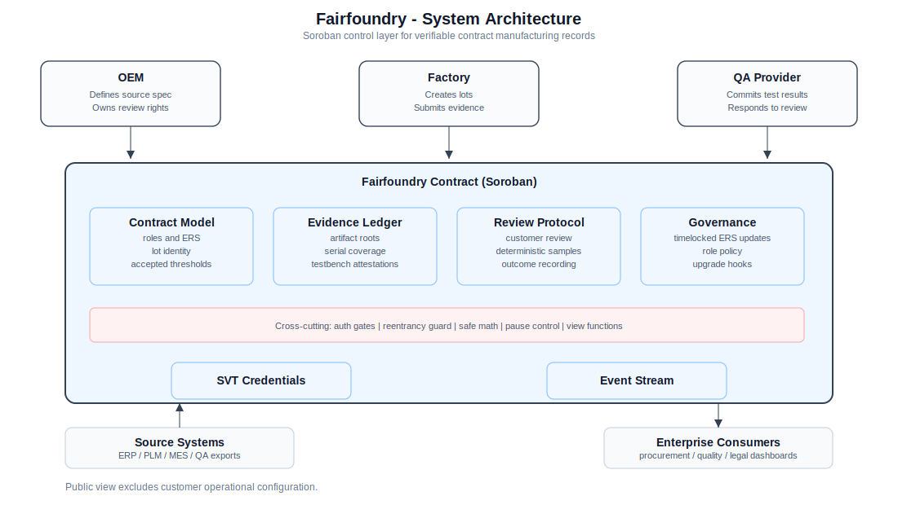
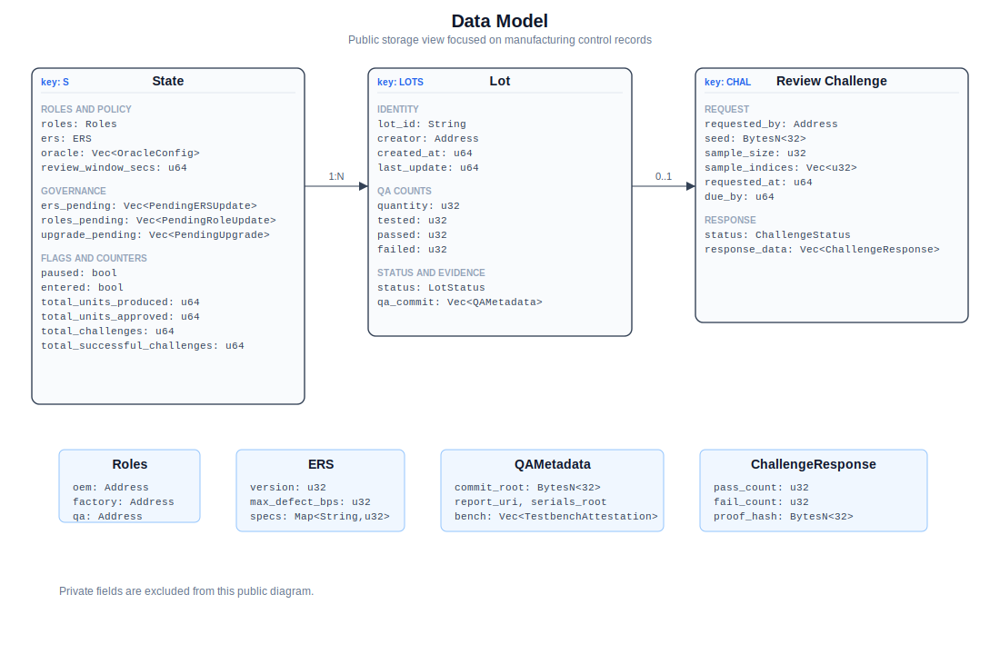
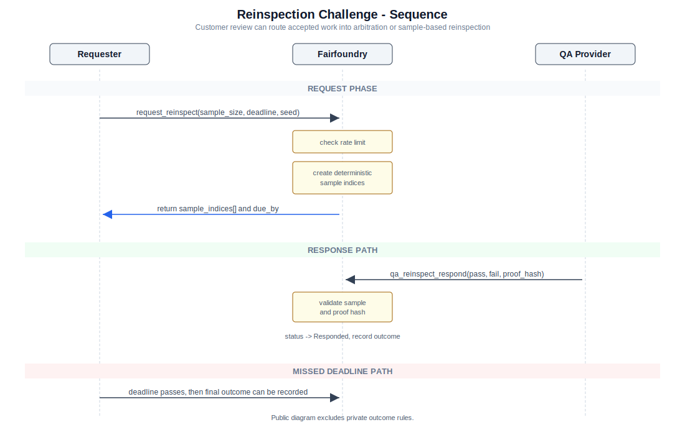
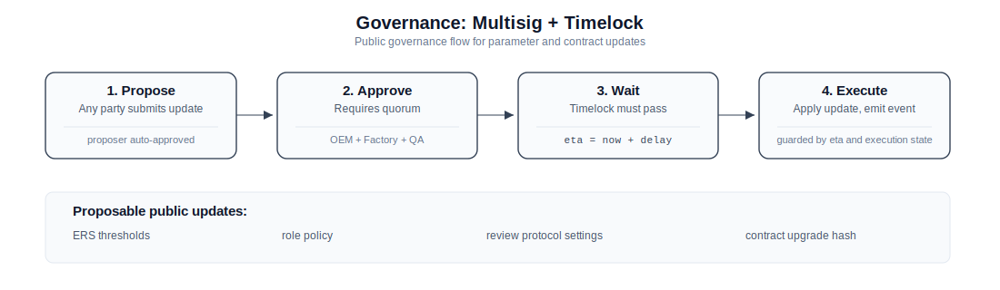
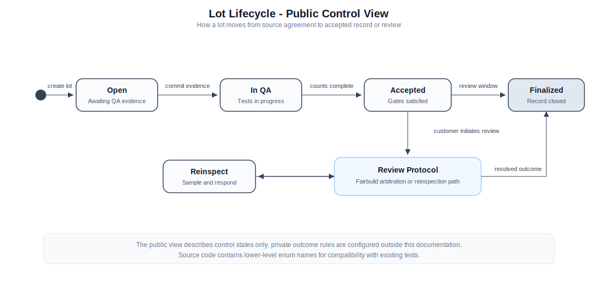
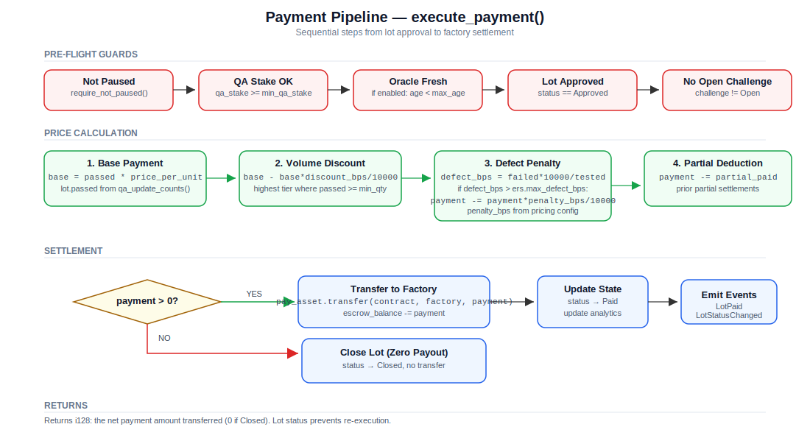
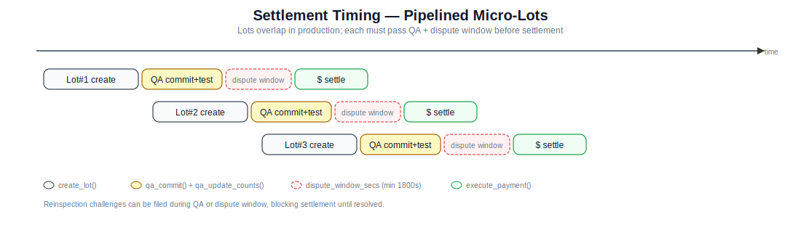

# Fairfoundry — escrowed manufacturing settlements with QA & challenges (Soroban)

> License: CC BY-NC 4.0 | Target chain: Stellar Soroban | Language: Rust (`soroban_sdk`)

## What this contract does (purpose)

Fairfoundry is a settlement layer for OEM <-> Factory production where a third-party QA signs off on lots. It holds OEM funds in escrow, tracks lot testing, lets any registered party request a re-inspection on a deterministic sample, and then settles payment to the factory (with discounts and defect penalties) only after QA and challenge windows clear. It also supports QA staking/slashing and an optional price oracle freshness check.



### Why Fairbuild

Fairbuild (fairb.com) helps OEMs and manufacturers of precision, high-volume products make production agreements **transparent, standardized, and enforceable**. By encoding a normalized contract on-chain -- covering escrow, milestones, ERS/QA metrics, and challenge/penalty rules -- Fairbuild reduces ambiguity and shortens dispute cycles. On-ledger events create a shared, tamper-evident record of lots, test results, and payments, improving supplier transparency and auditability. Production and contractual risk is managed through pre-funded escrow, staking/slashing for service levels, time-boxed challenge windows, and deterministic re-inspection. The same primitives carry across the full product lifecycle -- from NPI to volume to sustaining -- so quality targets and ERS versions remain traceable as products evolve.

## Quick start

> These instructions assume a recent Soroban toolchain. Command names can change across versions; when in doubt, run `soroban --help`.

### 1) Prerequisites

- Rust + Cargo
- Wasm target and CLI

```bash
# Install the correct Wasm target for your Rust version
# Rust >= 1.85.0 -> wasm32v1-none
rustup target add wasm32v1-none
# Older Rust versions -> wasm32-unknown-unknown
rustup target add wasm32-unknown-unknown

cargo install --locked soroban-cli
```

### 2) Build the contract

```bash
# From repo root (workspace Cargo.toml lives here)
cargo build --target wasm32-unknown-unknown --release

# Artifact: target/wasm32-unknown-unknown/release/fairfoundry.wasm
```

### 3) Run tests

```bash
# Run the full test suite (30 tests: flows, invariants, negative, properties, scenarios)
cargo test

# With output visible
cargo test -- --nocapture
```

### 4) Start a local network & configure

```bash
# Start a local network (one of these will work depending on your CLI version):
soroban local network start   # or:  soroban lab run

# Tell the CLI about the local network (RPC URL may vary by version)
soroban config network add local \
  --rpc-url http://localhost:8000 \
  --network-passphrase "Standalone Network ; February 2017"

# Create identities (keypairs) for each role
soroban config identity generate OEM
soroban config identity generate FACTORY
soroban config identity generate QA

# Fund accounts on the local network (airdrop)
soroban account airdrop --identity OEM --network local
soroban account airdrop --identity FACTORY --network local
soroban account airdrop --identity QA --network local
```

### 5) Deploy

```bash
# Deploy the compiled .wasm
CONTRACT_ID=$(soroban contract deploy \
  --wasm target/wasm32-unknown-unknown/release/fairfoundry.wasm \
  --network local \
  --source OEM)

echo "Deployed: $CONTRACT_ID"
```

### 6) Initialize

```bash
# Example init (adjust to your types and defaults)
soroban contract invoke --id $CONTRACT_ID --network local --source OEM -- \
  init \
  --oem $(soroban config identity address OEM) \
  --factory $(soroban config identity address FACTORY) \
  --qa $(soroban config identity address QA) \
  --pay_asset '{"kind":"NativeXlm","address":"CDLZ...","decimals":7}' \
  --pricing '{"price_per_unit":1000000,"defect_penalty_bps":500,"tiers":[{"min_qty":1000,"discount_bps":250}]}' \
  --ers '{"version":1,"max_defect_bps":500,"specs":{}}' \
  --config '{"min_escrow_lots":1,"min_qa_stake":100000000,"oem_bond":0,"dispute_window_secs":86400}' \
  --oracles '[]'
```

### 7) Try the core flow

Follow the commands in the [Example: calling flows with `soroban-cli`](#example-calling-flows-with-soroban-cli) section below to deposit escrow, create a lot, commit QA, (optionally) challenge, and settle payment.

## Actors & roles

- **OEM** -- deposits escrow, pays factory upon lot acceptance, co-beneficiary of slashing.
- **Factory** -- creates production lots, receives payment.
- **QA** -- commits testing metadata, updates pass/fail counts, stakes collateral and may be slashed for missed deadlines.

Roles are fixed at `init` via `Roles { oem, factory, qa }` and are validated with `require_auth` on every mutating call.

## High-level lifecycle



1. **Initialize** (`init`) with roles, payment asset, pricing, ERS, config (escrow/stake/bond/dispute params), and optional oracle configs.
2. **Fund escrow** (`deposit_escrow`) from OEM in the chosen payment asset (native XLM or a Stellar token).
3. **Create lot** (`create_lot`) by Factory with `{lot_id, quantity}` (bounded by `MAX_LOT_QUANTITY`).
4. **QA commit** -- two paths:
   - **Convenience functions** (recommended): `qa_commit` (root + report URI), then optionally `qa_commit_serials` (serials root/count) and `qa_commit_attestation` (testbench attestation).
   - **Full commit**: `qa_commit_full` with all fields in one call.
5. **QA progress updates** (`qa_update_counts`) to set `{tested, passed, failed}`. Lot auto-transitions `Open -> InQA -> Approved`.
6. **Challenge / re-inspection (optional)**:
   - Any role may `request_reinspect(lot_id, sample_size, deadline_secs, seed)`.
   - Contract **charges a challenge fee** (default `CHALLENGE_COST_BPS = 10` -> 0.1% of lot value) and **rate-limits** to max 5/hour per address.
   - Deterministic sampler returns unique indices from `[0, quantity)` capped by `MAX_CHALLENGE_SAMPLE`.
   - QA must `qa_reinspect_respond(pass_count, fail_count, proof_hash)` **before** `due_by` or risk default.
   - If QA misses the deadline, anyone may call `challenge_default_slash(slash_bps)` -> slashes QA stake (capped by `MAX_SLASH_BPS`, 20%). Slash is split **50% challenger / 50% OEM** and the QA's locked stake is unlocked.
7. **Settle payment** (`execute_payment`):
   - Enforces oracle freshness if enabled.
   - Computes payment = `passed * price_per_unit` minus tier discounts and a **defect penalty** if defect rate exceeds ERS's `max_defect_bps`.
   - Debits contract escrow and transfers to Factory. Emits `LotPaid`.

## Commercial logic & parameters

### Payment asset

```rust
AssetKind::{ NativeXlm, StellarAsset(BytesN<32>) }
PaymentAsset { kind, address, decimals }
```

Used through the Soroban token interface; funds live in the contract account until settlement. The `address` field holds the token contract address used for transfers.

### Pricing & discounts

```rust
Pricing {
  price_per_unit: i128,
  defect_penalty_bps: u32,
  tiers: Vec<DiscountTier{min_qty:u32, discount_bps:u32}>
}
```

- `compute_price_for_lot` applies the **highest** `discount_bps` tier where `passed >= min_qty`.
- If actual defect rate (`failed/tested`) **> ERS.max_defect_bps**, a penalty is applied: `payment -= payment * defect_penalty_bps / 10_000`.

### ERS (Engineering/Quality spec)

```rust
ERS {
  version: u32,
  max_defect_bps: u32,
  specs: Map<String, u32>
}
```

`specs` holds arbitrary key/value thresholds (e.g., test counts). `propose_ers` queues an update behind a governance timelock (see below).

### Challenges & sampling



- **Cost**: `challenge_cost = lot_value * CHALLENGE_COST_BPS / 10_000`.
  - If OEM is requester, fee is taken from **escrow**; others pay upfront transfer.
- **Locking**: request locks 20% of `min_qa_stake` until resolved.
- **Respond**: timely response refunds the challenge fee to requester.
- **Default / Slash**: on missed deadline, `challenge_default_slash(slash_bps)` splits slash 50/50 to challenger and OEM; capped by `MAX_SLASH_BPS`.
- **Rate limiting**: per-address `<=5` challenges/hour.
- **Sampler**: `deterministic_sample(quantity, sample_size, seed)` returns up to `MAX_CHALLENGE_SAMPLE` distinct indices.

### Oracle (optional)

```rust
OracleConfig { oracle, quote: Symbol, max_age_secs, enabled, last_price, last_update }
```

- `execute_payment` checks `last_update` against `max_age_secs` when `enabled`.
- `update_oracle_price` requires the `oracle` to `require_auth()`.

## Governance & timelock



```rust
Timelock { eta, approvals: Vec<Address>, executed }
quorum_ok(approvals) => len >= 2
MIN_TIMELOCK_DELAY = 3600 seconds
```

- Implemented proposal path: `propose_ers` enqueues an ERS update with a delay (>= `MIN_TIMELOCK_DELAY`).
- The code contains pending queues for **pricing, roles, and upgrades**, but their apply/approve functions are not included in this file.

## State & storage layout

**Top-level `State`** (stored under key `S`):

- `roles: Roles`
- `pay_asset: PaymentAsset`
- `pricing: Pricing`
- `ers: ERS`
- `oracle: Vec<OracleConfig>` (empty = disabled, one element = enabled)
- `min_escrow_lots: u32`
- `escrow_balance: i128`
- **QA staking**: `min_qa_stake, qa_stake, qa_locked_stake, qa_unstake_requests`
- **Stats**: `paused: bool`, totals for produced/approved/challenges
- **Pending updates**: `ers_pending, pricing_pending, roles_pending, upgrade_pending`
- Reentrancy guard: `entered: bool`

**Maps**

- `LOTS: Map<String, Lot>` -- `{lot_id, quantity, tested, passed, failed, status, qa_commit, created_at, last_update, pay_nonce, partial_paid_amount, creator}`
- `CHAL: Map<String, Challenge>` -- `{requested_by, seed, sample_size, sample_indices, requested_at, due_by, status, cost_paid, response_data}`
- `CHAL_LIMIT: Map<Address, (u64, u32)>` -- challenge rate limiting `(last_time, count)`

**Events** `EscrowDeposited`, `EscrowWithdrawn`, `QAStaked`, `QAUnstakeRequested`, `QAUnstaked`, `LotCreated`, `QACommittedFull`, `QAUpdated`, `LotStatusChanged`, `ReinspectRequested`, `ReinspectResponded`, `ReinspectDefaultSlashed`, `LotPaid`, `ERSProposed`, `OracleUpdated`.

## Security model (what protects funds)

- **Role-gated mutators** with `Address::require_auth()`; `require_party` restricts to OEM/Factory/QA.
- **Reentrancy guard** (`entered` with `enter/exit`) wraps state-mutating flows.
- **Safe math** wrappers (`safe_add/sub/mul`) trap on overflow.
- **Bounds & caps**: `MAX_LOT_QUANTITY`, `MAX_CHALLENGE_SAMPLE`, `MAX_SLASH_BPS`.
- **Challenge rate-limit**: <=5/hour per address.
- **Oracle freshness**: `OracleStale` error if outdated.
- **Unstake delay**: `QA_UNSTAKE_DELAY = 7 days`; cannot unstake below `min_qa_stake`.

## Public API (summary)

### Mutators

| Function | Who can call | Effect | Emits |
| --- | --- | --- | --- |
| `init(oem, factory, qa, pay_asset, pricing, ers, config, oracles)` | OEM, Factory & QA `require_auth` | Bootstraps state | `Fairfoundry:init` (log) |
| `deposit_escrow(from, amount)` | **OEM** | Transfer token -> contract; increase `escrow_balance` | `EscrowDeposited` |
| `withdraw_escrow(oem, amount)` | **OEM** | Transfer token <- contract; decrease `escrow_balance` | `EscrowWithdrawn` |
| `stake_qa(qa, amount)` | **QA** | Transfer token -> contract; increase `qa_stake` | `QAStaked` |
| `request_unstake_qa(qa, amount)` | **QA** | Queue delayed unstake; enforces min stake | `QAUnstakeRequested` |
| `execute_unstake_qa(qa)` | **QA** | After delay, transfers available queued amount to QA | `QAUnstaked` |
| `create_lot(factory, lot_id, quantity)` | **Factory** | Create `Lot` (requires QA stake >= min) | `LotCreated` |
| `qa_commit(qa, lot_id, commit_root, report_uri)` | **QA** | Attach QA metadata (root + report); set status `InQA` | `QACommittedFull` |
| `qa_commit_serials(qa, lot_id, serials_root, serials_count)` | **QA** | Add serials Merkle root to existing QA metadata | `QACommittedFull` |
| `qa_commit_attestation(qa, lot_id, bench_id, firmware_hash, signer)` | **QA** | Add testbench attestation to existing QA metadata | `QACommittedFull` |
| `qa_commit_full(qa, lot_id, commit_root, report_uri, serials_root, serials_count, bench_id, firmware_hash, signer)` | **QA** | Full QA metadata in one call; set status `InQA` | `QACommittedFull` |
| `qa_update_counts(qa, lot_id, tested, passed, failed)` | **QA** | Update counts; auto `Approved` when `tested == quantity` | `QAUpdated` |
| `request_reinspect(requester, lot_id, sample_size, deadline_secs, seed)` | OEM/Factory/QA | Charge fee, lock QA stake, store challenge & sample indices | `ReinspectRequested` |
| `qa_reinspect_respond(qa, lot_id, pass_count, fail_count, proof_hash)` | **QA** | Record response; refund fee if timely; unlock QA lock | `ReinspectResponded` |
| `challenge_default_slash(caller, lot_id, slash_bps)` | Any role | If overdue, slash QA stake (<=20%); split to challenger & OEM | `ReinspectDefaultSlashed` |
| `execute_payment(lot_id)` | Any role | Transfer escrow -> Factory; apply discounts & defect penalty; fail if open challenge | `LotPaid` |
| `propose_ers(caller, ers, delay_secs)` | Any role | Queue ERS update with timelock (>=1h) | `ERSProposed` |
| `update_oracle_price(oracle, price)` | **Oracle signer** | Update oracle price and timestamp | `OracleUpdated` |

### Views (read-only)

| Function | Returns |
| --- | --- |
| `view_state()` | Full contract `State` |
| `view_lot(lot_id)` | Single `Lot` |
| `view_lots(status_filter)` | List of lot IDs, optionally filtered by status |
| `view_lots_batch(lot_ids)` | Batch fetch multiple `Lot` structs |
| `view_challenge(lot_id)` | `Challenge` for the lot |
| `view_analytics()` | `Analytics` struct with production/stake/escrow stats |
| `view_unstake_requests()` | List of pending QA `UnstakeRequest` items |
| `view_pending_ers()` | Pending ERS governance proposals |
| `view_qa_stake()` | `(total, locked, available)` QA stake breakdown |
| `view_challenge_limit(addr)` | `(remaining, window_reset_time)` for rate limiting |

> **Note:** The file defines pending queues for pricing/roles/upgrades but only `propose_ers` is wired. Additional approve/execute methods would be needed to complete governance for those queues.

## Invariants & failure modes

- `tested == passed + failed` must hold; otherwise `InvalidCounts`.
- Payment path rejects if: (a) QA stake < min, (b) oracle stale (when enabled), (c) there's an **open** challenge for the lot.
- Challenge request fails if rate-limited, fee can't be collected, or sample size > `MAX_CHALLENGE_SAMPLE`.
- Withdrawals/unstakes that would underflow balances revert with `Overflow`/`InsufficientStake` errors.

## Example: calling flows with `soroban-cli`

```bash
# Addresses (example placeholders)
OEM=G...OEM   FACTORY=G...FACT   QA=G...QA   ORACLE=G...ORAC
CONTRACT=CA...CTID

# Deposit escrow (OEM)
soroban contract invoke \
  --id $CONTRACT \
  --source $OEM \
  -- \
  deposit_escrow \
  --from $OEM \
  --amount 1000000000     # 1,000 units in token's minor units

# Factory creates a lot
soroban contract invoke --id $CONTRACT --source $FACTORY -- \
  create_lot --factory $FACTORY --lot_id L23-042 --quantity 5000

# QA commits metadata (convenience functions)
soroban contract invoke --id $CONTRACT --source $QA -- \
  qa_commit --qa $QA --lot_id L23-042 \
  --commit_root 0x... --report_uri ipfs://...

soroban contract invoke --id $CONTRACT --source $QA -- \
  qa_commit_serials --qa $QA --lot_id L23-042 \
  --serials_root 0x... --serials_count 5000

# Request re-inspection (OEM)
soroban contract invoke --id $CONTRACT --source $OEM -- \
  request_reinspect --requester $OEM --lot_id L23-042 \
  --sample_size 100 --deadline_secs 86400 --seed 0x...

# QA responds
soroban contract invoke --id $CONTRACT --source $QA -- \
  qa_reinspect_respond --qa $QA --lot_id L23-042 \
  --pass_count 98 --fail_count 2 --proof_hash 0x...

# Execute payment
soroban contract invoke --id $CONTRACT --source $OEM -- \
  execute_payment --lot_id L23-042
```

## Visual diagrams

### State machine



```
Open --(qa_commit)--> InQA --(qa_update_counts until tested==quantity)--> Approved
  |                            |                    |
  '----(request_reinspect)-----+--> Challenge(Open)--+--> Responded/Expired
                                                    |
                                        (no Open challenge) --> Paid/Closed
```

### Payment pipeline



### Settlement timing



## Known limitations & TODOs

- Governance queues exist for **pricing/roles/upgrades** but only ERS has a proposer. Add approve/execute paths.
- `paused` flag is present but not exposed; add pause/unpause admin gated by timelock.
- Consider allowing **partial payments** per milestone (the field `partial_paid_amount` exists but isn't exercised).
- Add events for more governance operations once implemented.

## Error codes

| Code | Name | Description |
| ---: | --- | --- |
| 1 | `NotAuthorized` | Caller does not hold the required role (OEM, Factory, or QA) or failed `require_auth`. |
| 2 | `InvalidState` | Operation attempted in a state that does not permit it (paused contract, wrong lot status, QA stake below minimum, or open challenge blocks payment). |
| 3 | `InsufficientEscrow` | Escrow balance is insufficient for the requested operation. |
| 4 | `InvalidCounts` | Test counts are invalid: `tested != passed + failed` or `tested > quantity`. |
| 5 | `NotFound` | Referenced lot or challenge does not exist in storage. |
| 6 | `AlreadyExists` | A lot with the given ID already exists. |
| 7 | `TimelockActive` | A governance timelock is still active; cannot apply or override. |
| 8 | `AlreadyExecuted` | The governance proposal has already been executed. |
| 9 | `OracleStale` | Oracle price data is older than `max_age_secs`. |
| 10 | `Param` | Generic parameter validation failure (zero amounts, out-of-range quantities, etc.). |
| 11 | `TooEarlyOrLate` | Attempted to slash before the challenge deadline has passed. |
| 12 | `Reentrancy` | Reentrancy guard triggered -- a nested call attempted state mutation. |
| 13 | `NoChallenge` | No challenge exists for the given lot. |
| 14 | `Overflow` | Arithmetic overflow in safe math operations. |
| 15 | `InvalidProof` | Reserved for future use: invalid Merkle proof verification. |
| 16 | `ChallengeLimitExceeded` | Address has exceeded the per-hour challenge rate limit (max 5/hour). |
| 17 | `InsufficientStake` | QA stake is insufficient or would drop below `min_qa_stake`. |
| 18 | `UnstakePending` | Reserved for future use: unstake request conflicts. |

## Testing

The test suite includes **30 tests** across five modules:

- **flows** (2 tests): Full happy-path lifecycle with attestation, serials, and reinspection; default slash on missed reinspection deadline.
- **invariants** (1 test): Multi-lot escrow and stake invariants hold across challenges.
- **negative** (15 tests): Auth failures, parameter validation, status transition guards, challenge edge cases.
- **properties** (7 tests): Conservation laws -- escrow non-negative, locked stake <= total stake, approved <= produced, lot count invariant, sample uniqueness, unstake minimum preservation, challenge cost formula.
- **scenarios** (5 tests): Multi-lot pipeline, ERS governance proposal, QA unstake lifecycle, oracle freshness blocking payment, challenge fee refund on timely response.

```bash
cargo test
```

## Project structure

```
Fairfoundry/
  Cargo.toml                           # Workspace root
  contracts/
    fairfoundry/
      Cargo.toml                       # Crate manifest (soroban-sdk)
      src/
        lib.rs                         # Contract implementation (~1800 lines)
        test/
          mod.rs                       # Test module root
          flows.rs                     # Integration flow tests
          invariants.rs                # Multi-lot invariant tests
          negative.rs                  # Negative / error path tests
          properties.rs                # Property / conservation law tests
          scenarios.rs                 # End-to-end scenario tests
  assets/                              # SVG diagrams
    fairfoundry_architecture.svg
    fairfoundry_data_model.svg
    fairfoundry_governance_timelock.svg
    fairfoundry_payment_pipeline.svg
    fairfoundry_reinspection_sequence.svg
    fairfoundry_settlement_timing.svg
    fairfoundry_state_machine.svg
  .github/workflows/ci.yml            # GitHub Actions CI
  CONTRIBUTING.md                      # Contribution guide
  LICENSE                              # CC BY-NC 4.0
```

---

**Security note**: This contract has not been audited. Review, fuzz, and formally verify critical paths (escrow transfers, challenge/slash, settlement math) before mainnet deployment.
